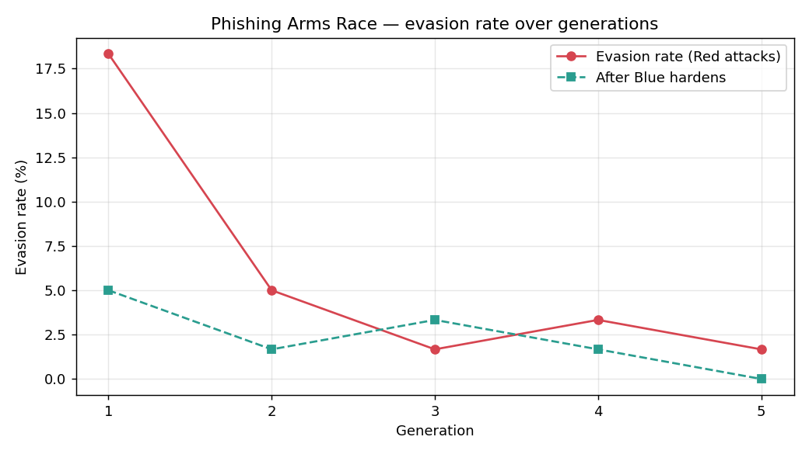
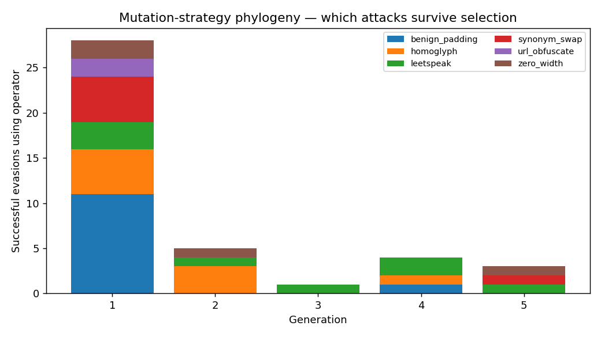

# 🧬 PhishArms — A Self-Evolving Phishing Defense

> A phishing detector that **trains against an adversary that's trying to beat it** — and gets stronger every generation.

[](https://github.com/Muskan-2504/phishing-arms-race/actions/workflows/ci.yml)


Most phishing classifiers are trained once on a fixed dataset and quietly rot the
moment attackers change tactics. **PhishArms** flips that. It pits two agents
against each other in a generational loop:

- 🔴 **Red team** — a black-box evasion attacker that *mutates* phishing emails
  (leetspeak, Unicode look-alikes, invisible characters, paraphrasing,
  signal-flooding) until they slip past the detector.
- 🔵 **Blue team** — a phishing classifier that folds every successful evasion
  back into its training set and **re-hardens**.

Run it, and you watch an arms race play out: the attacker finds holes, the
defender patches them, the attacker adapts. Measurably.

---

## 📊 Results (reproducible: `python scripts/run_arms_race.py`)

Over 5 generations on a balanced sample of real phishing/legit emails
(SpamAssassin + CEAS-08 + phishing-email corpora):



| Generation | Evasion rate (Red wins) | Evasions found | Clean accuracy |
| :--------: | :---------------------: | :------------: | :------------: |
|     1      |        **18.3%**        |       11       |     0.958      |
|     2      |          5.0%           |       3        |     0.961      |
|     3      |          1.7%           |       1        |     0.960      |
|     4      |          3.3%           |       2        |     0.959      |
|     5      |        **1.7%**         |       1        |     0.960      |

**The detector's evasion rate fell from 18.3% → 1.7% — a ~90% reduction in
successful attacks — while clean-email accuracy held steady at 96% (no
catastrophic forgetting).**

### Which attacks survive selection?



In generation 1, **signal-flooding (`benign_padding`)** was the dominant
evasion — diluting the phishing signal with innocuous filler beat the detector
11/11 times. As the arms race progressed and Blue learned to ignore the padding,
the surviving attacks shifted toward **character-level tricks** (leetspeak,
homoglyphs) — a visible evolution of attacker strategy.

---

## 🧠 The core idea: adversarial symmetry

The detector's features were **co-designed with the attacker's mutations**.
Several Blue-team signals exist precisely to catch specific Red-team tricks:

| 🔴 Red mutation             | 🔵 Blue counter-feature        |
| --------------------------- | ------------------------------ |
| `homoglyph` (Cyrillic `а`)  | `homoglyph_score`              |
| `zero_width` injection      | `zero_width_count`             |
| `leetspeak` (`p@yp4l`)      | `leetspeak_score`              |
| `url_obfuscate` (`hxxp://`) | `num_links`, `has_ip_url`      |
| `benign_padding`            | `text_length`, `capital_ratio` |

This is what makes the system *learn*: when Red leans on a tactic, the matching
feature lights up, and `harden()` teaches the model to weight it.

---

## 🏗️ Architecture

```
              arena.py  ── co-evolution loop ──┐
                 │                              │
     attacks (black-box probs)          harden(evasions)
                 ▼                              ▼
          attacker.py  (Red)            detector.py  (Blue)
                 │                              │
            mutations.py                   features.py
         6 evasion operators        12 signals (some built to
        (leet, homoglyph, …)         catch those very operators)
```

See [docs/architecture.md](docs/architecture.md) for the full design and the
reasoning behind the layout.

---

## 🚀 Quickstart

```bash
git clone https://github.com/Muskan-2504/phishing-arms-race.git
cd phishing-arms-race
pip install -r requirements.txt

# 1. Train the Blue-team baseline (uses the bundled sample dataset)
python scripts/train_baseline.py

# 2. Run the arms race and generate the charts above
python scripts/run_arms_race.py --generations 5

# 3. Explore it interactively
streamlit run dashboard/app.py
```

The repo ships with a balanced 4,500-email sample so everything runs out of the
box — no large downloads required.

### Interactive control room

`streamlit run dashboard/app.py` opens three tabs:

- **⚔️ Arms Race** — the evasion curve, operator phylogeny, and example evasions.
- **🔬 Live Probe** — paste any email; the detector scores it, then the Red team
  tries to evade it live and shows you the mutation that worked.
- **📬 Gmail Scan** — scan a real inbox over IMAP (credentials via `.env`).

---

## 📁 Project layout

```
phishing-arms-race/
├── src/phisharms/          # the importable package
│   ├── features.py         # adversarially-aware feature engineering (12 signals)
│   ├── detector.py         # Blue team: TF-IDF + RF, with harden() for in-place retraining
│   ├── mutations.py        # Red team's 6 evasion operators (a pluggable registry)
│   ├── attacker.py         # Red team: black-box search over mutation chains
│   ├── arena.py            # the generational co-evolution loop
│   ├── viz.py              # results → charts
│   └── data.py             # dataset loading
├── scripts/                # CLI entry points (build_sample, train_baseline, run_arms_race)
├── dashboard/              # Streamlit control room
├── tests/                  # pytest suite (mutations, detector, arena)
├── data/sample_emails.csv  # bundled balanced sample
└── .github/workflows/ci.yml# lint + tests + arms-race smoke test on every push
```

---

## 🔬 Data

The bundled `data/sample_emails.csv` is enough to reproduce the headline results.
To run at full scale, download the public corpora and rebuild the sample (or
point `--data` at the full CSVs):

- [SpamAssassin Public Corpus](https://spamassassin.apache.org/old/publiccorpus/)
- [CEAS 2008 / phishing-email datasets (Kaggle)](https://www.kaggle.com/datasets)

```bash
# place the raw CSVs in data/raw/ then:
python scripts/build_sample.py --inputs data/raw/CEAS_08.csv data/raw/phishing_email.csv --n 4500
```

Raw datasets and trained `.joblib` models are git-ignored — they're regenerated
by the scripts above.

---

## 🛡️ Security note

Credentials are **never** hardcoded. The live Gmail scanner reads a Google
[App Password](https://support.google.com/accounts/answer/185833) from a
git-ignored `.env` file — copy `.env.example` to `.env` and fill in your own.

---

## 🧪 Development

```bash
pip install pytest ruff
ruff check src tests   # lint
pytest -q              # run the test suite
```

---

## 📜 License

MIT — see [LICENSE](LICENSE).

---

## 🗺️ Roadmap

- LLM-driven Red team for natural-language paraphrase attacks
- DistilBERT detector benchmarked head-to-head against the TF-IDF baseline
- Per-prediction explanations (SHAP) surfaced in the dashboard

## 👤 Author

**Muskan** · [@Muskan-2504](https://github.com/Muskan-2504)

Built as a hands-on exploration of adversarial machine learning for email security.
